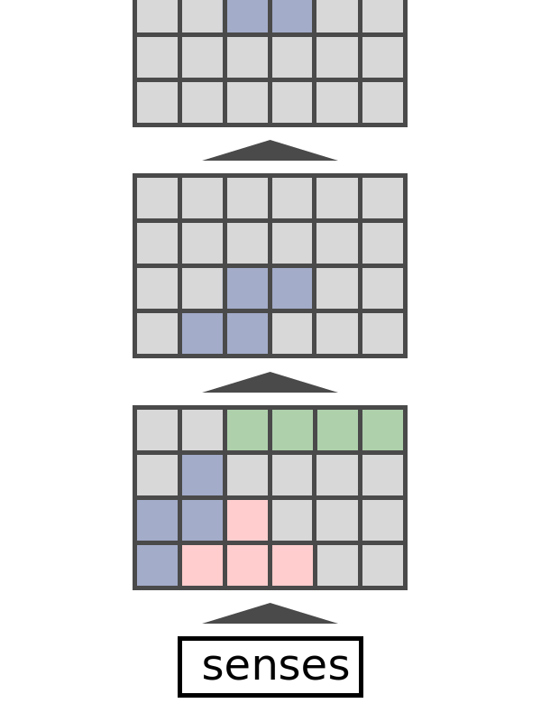

# Learning as a hierarchy of compressions

Learning is a series of hierarchal compressions. Inputs come from the world through the senses and build toward high-level abstractions through a series of compressions that take the output of the previous levels as outputs.

## Compressing inputs

Each layer takes a handful of input objects at a time, tries out different configurations, looking for configurations where the inputs compress into a class object. The compressed object is then handed up to the next level of abstraction.

The lowest level takes inputs from the senses.

Before handing up a compressed object, the quality of compression is considered. The encapsulated output can be described as having material properties. A capsule's properties can be determined by testing the object against example inputs.

Ideally, a capsule should be dense, hard, flexible. Such materials are resilient to erosion from the constant stream of objects and allow for similarly strong high-level capsules.

## Hierarchy and Recursion

Generally, each layer takes inputs from the lower level. Occasionally, higher-level abstractions might be brought down to a lower level to assist in a type of recursive compression. Similarly, low-level inputs might be brought up several levels to test compression quality.

## Mistakes and Unlearning

Errors are detected when a capsule fails on new examples.

Often, errors are not detected until a fairly high-level. In such cases, refactoring is required by working down the compression chain. The difficulty of unlearning depends on the graph complexity of the dependancies.

In the worst case, unlearning can get stuck when following the compression chain down to a concept for which is there no alternative compression scheme and there are many other chains depending on that seed. Then, the learner is forced to either:

- continue building on the same compression chain, while knowing there is a fundamental issue with their knowledge base
- attempt to build a hanging thread that they hope to incorporate someday in the future

## Ecologies for accelerating learning

Environments that accelerate learning have the following properties:

- allow for quick iterative failures / attempts
- provide a clear target to aim towards
- proving a diverse range of approaches to accommodate for preexisting bases of knowledge   

The most common educational ecology is with two classes, teachers and students. The teachers are trying to learn the optimal input sequences that enable students to learn with speed and quality. The students are focused on learning by synthesizing inputs from the teacher with their pre-existing knowledge graph.

Teachers also spend effort attempting to trigger the necessary unlearning in some students to make leaps to higher level learning.

### Teaching yourself

Without access to a classroom, an individual can attempt to simulate the ecology by themselves. They then have two tasks to manage, learning a suitable sequence of inputs to reach the high-level object they are attempting to target, while also doing the compression learning work.

## Sources

- Beunza, Daniel and Garud, Raghu. _Calculators, lemmings or frame-makers? the intermediary role of securities analysts_. The Sociological Review.
- Hawkins, Jeff. _On Intelligence: How a New Understanding of the Brain Will Lead to the Creation of Truly Intelligent Machines_.
- Schmidhuber, Juergen. _Driven by Compression Progress: A Simple Principle Explains Essential Aspects of Subjective Beauty, Novelty, Surprise, Interestingness, Attention, Curiosity, Creativity, Art, Science, Music, Jokes_.
- Valiant, Leslie. _Probably Approximately Correct: Nature's Algorithms for Learning and Prospering in a Complex World_.
