Instructions for submitting coursework using Github. Key Github terminology/vocabulary are bolded. The User name we use for the tutorial is **[TaeyoonTA](https://github.com/TaeyoonTA).** You will have your own ID. There are two parts to the tutorial.  

 
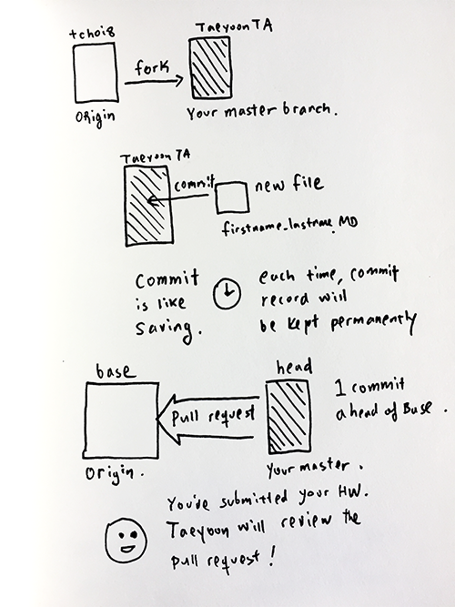

##### Part 1: Submitting your homework
1. We start with the **origin repository**: [tchoi8/teachingasart2018](https://github.com/tchoi8/teachingasart2018). You will probably want to open this link in a new window so you can follow along the steps.

2. **Forking**: forking a repository allows you to make a version of your own copy. It will automatically bring in all the folders and files from the origin repository to a forked version in your acount name.

In the **origin repository** click "Fork" on the upper right side. You will now have a copy of all the contents from the **origin repository**. Instead of saying "TaeyoonTA/teachingasart2018" it will have your account name before the backslash

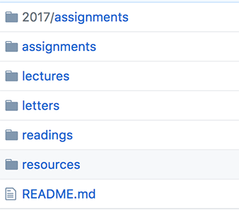

3. Go back into the [**origin repository**](https://github.com/tchoi8/teachingasart2018) and click into the assignments folder, following the path for the corresponding week/file. Highlight and use Control C to copy the contents of the homework for the week we are at. 

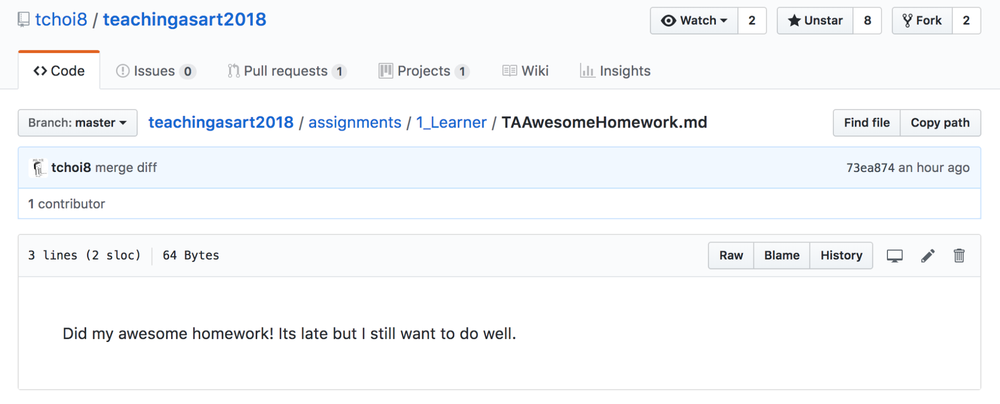
*Note how we are in tchoi8/teachingasart2018 not your account name*

4. Once you have highlighted and copied the contents of the week's assignment, go back into your forked repository and into the assignments folder. Press [Create new file] once you are in the correct week/folder. Here, we are within "1_Learner" within the Assignments folder

5. Name your file "FirstName_LastName.**md**" - which will save your document as a Markdown file, meaning you can style the document with images, hyperlinks, bold and italics fonts, etc, and paste the contents. Refer to this [cheatsheet](https://github.com/adam-p/markdown-here/wiki/Markdown-Cheatsheet) for details. You'll need to upload images to /img folder of each assignment folder. 

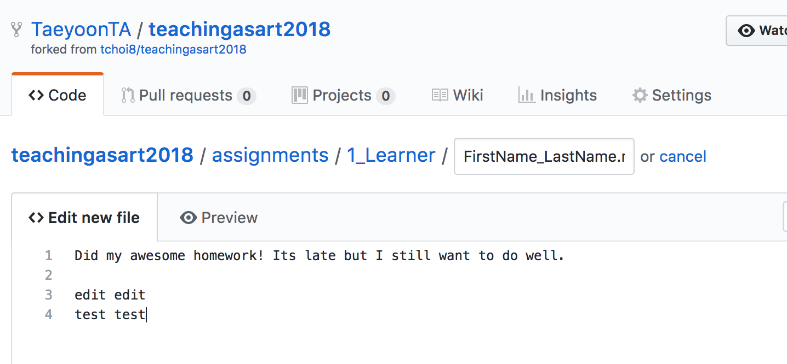

6. In this interface, you will edit and add to the document, whatever the assignment for the week calls for. *Note how we are in your forked version, not Taeyoon's version.*

   For each assignment, you will need to include images. Uploading an image onto a Github markdown file requires you to use a    relative path, meaning you need to upload the images directly to Github in order to reference them. In each week's            assignment folder, you will see a folder for images, labeled "img." Before you start formatting your homework as a Github      markdown file, add your images to the img folder and then **commit** to save. It will be beneficial for you to name them in    an organized way. 

"img" folder within Assigments > 1_Learner

Click upload file 

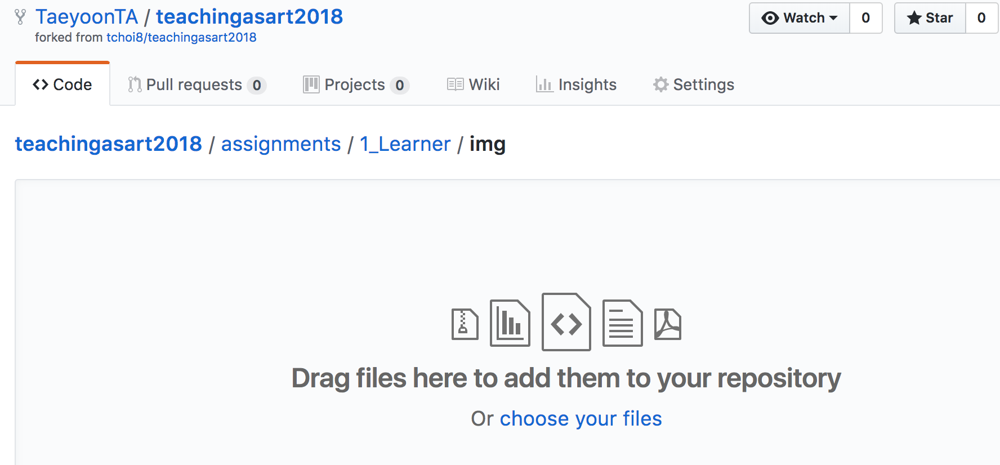
Choose your files

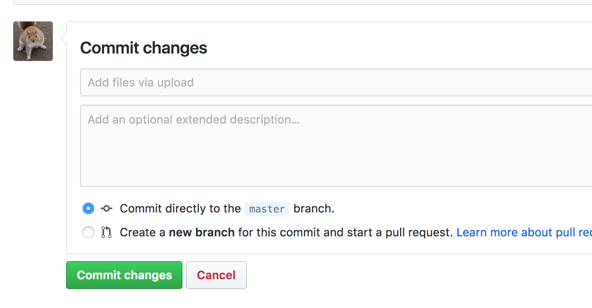
Commit changes to save

   Once you have uploaded your images into the img folder you will then be able to reference their path in the markdown file editor. The syntax is an exclamation point [image title] (image path). You can choose to leave the brackets blank, like [].    The image path will look something like ! [] (https://github.com/tchoi8/teachingasart2018/assignments/1_Learner/img/Filename.png) but without spaces.  

7. Once you have completed editing your homework, scroll to the bottom to **commit** the file. In Github, committing is like saving. Again, make sure to save the document as a **.md** file. You want to be committing directly to the master branch **not** starting a new branch. 

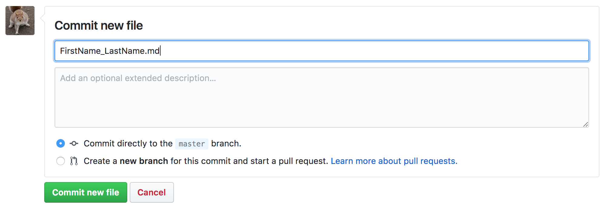

8. After you press [Commit new file], Github will return you to your repository page, and you should now see your file in the folder structure under Assignments > 1_Learner

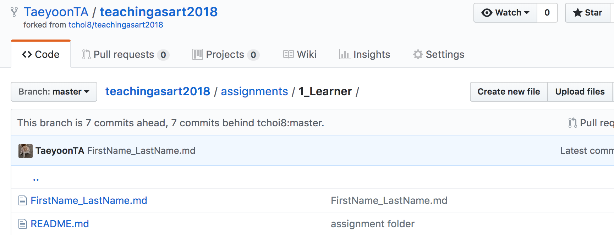
**"FirstName_LastName.md** is there now, yay!

9. All of this editing and commiting has been within your forked version of the original repository. To submit your work to Taeyoon, you will need to create a **Pull request.** This is similar to the concept of asking to "publish." To do so, we will need to go back to the **origin repository**, which you can easily access by clicking tchoi8/teachingasart2018

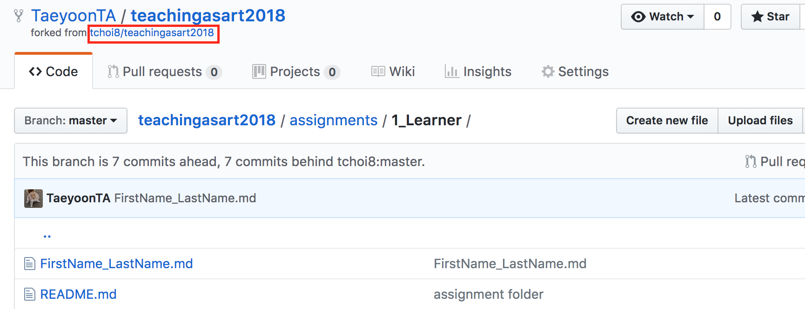

10. In the **origin repository** click [New pull request]

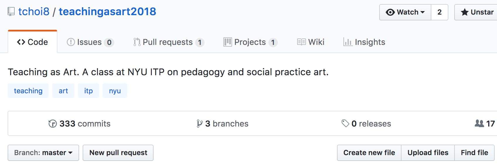

11. Click **compare across forks** and use the drop down arrows to make sure "tchoi8/teachingasart2018 is the **base fork** on the left side, and your account name is the **head fork** on the right side.

12. You will submit your **pull request** by entering in your document name, "FirstName_LastName.md" and clicking [Create pull request]. This will now submit your edited document into Taeyoon's repo. This is how you submit your homework to be reviewed. 

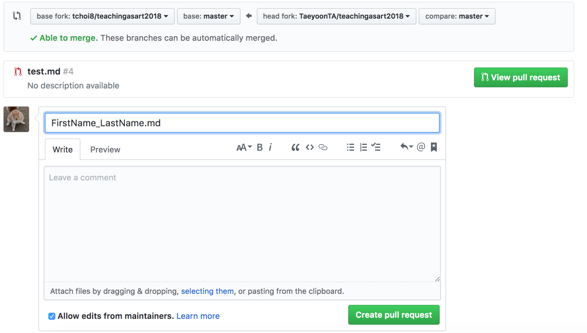

13. Once you've submitted your pull requests, Taeyoon will review the homework, and he will decide to **accept, comment or close.** He may ask you to revise and add more content before accepting the homework. In that case, he may close the pull request and wait for you to make a new pull request with an updated homework. 

------------
##### Part 2: Getting the latest homework

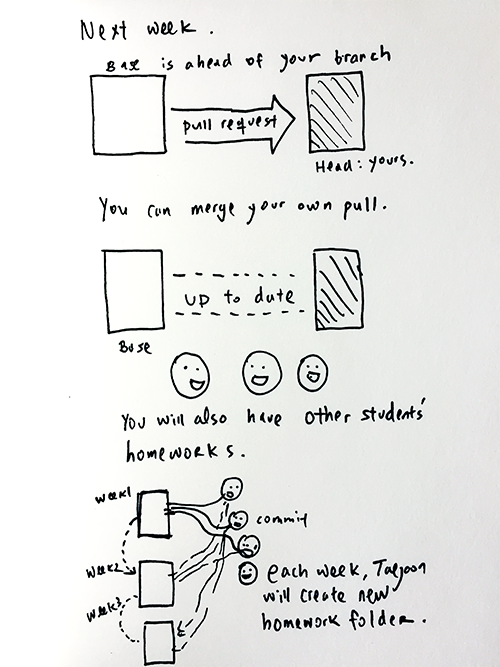

In the pull request just demonstrated, we merged new edits from your account's repository into Taeyoon's repository, submitting your homework to his account. In this scenario, we had 'tchoi8/teachingasart2018" on the left side under **base fork** and your account "TaeyoonTA/teachingasart2018" on the right side under **head fork.**

As Taeyoon adds new assignment folders for each week, we will have to perform the reverse action, merging new additions from his origin repo into your account's repo. 

To do this, click into the **Pull requests** tab again and click [New pull request]. Now, use the drop down arrow to select your account's repo on the left side as **base fork** and Taeyoon's origin repo on the right side as *head fork.* You may have to click ocmpare acorss froks again. 
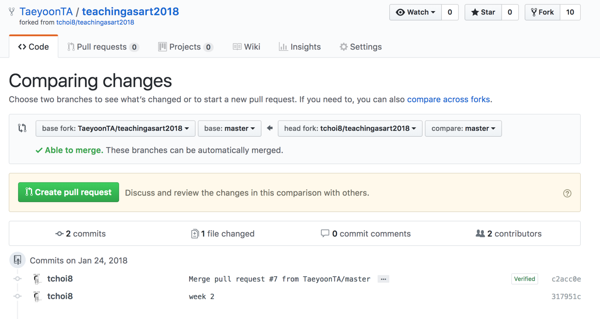

Click [Create pull request]. You can see under "Commits on Jan 24, 2018" a line for "week 2." You will now be pulling and merging Taeyoon's edits and additions into your own repository, adding the latest week's assignment folder into your account.
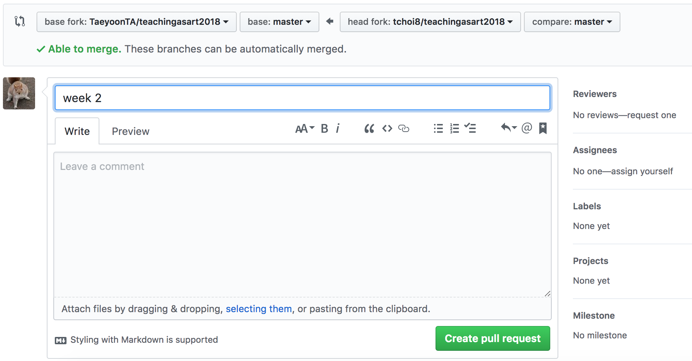

Under title, type the corresponding week and click [Create pull request] once more.
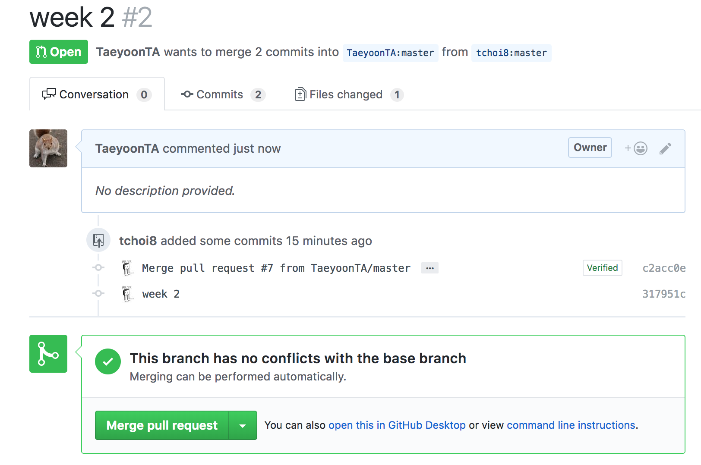

The last step is to click [Merge pull request].
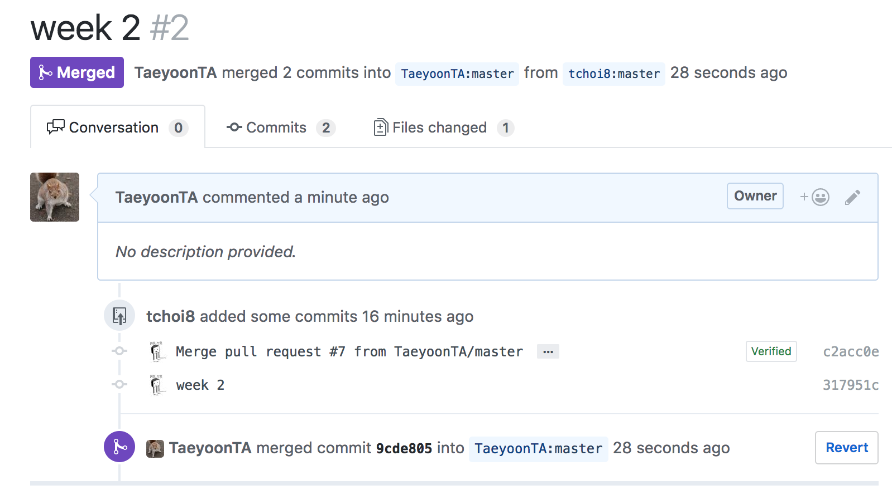

Once you do this, you will see "week 2" has changed from **Open** in green text to **Merged** in purple text.
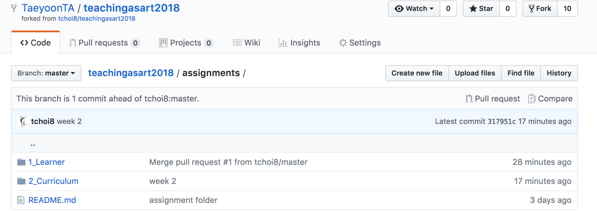

If you now go into your repo you will see the folder "2_Curriculum" within your assignments folder. You have successfully added the newest homework folder into your repository. 

------------

